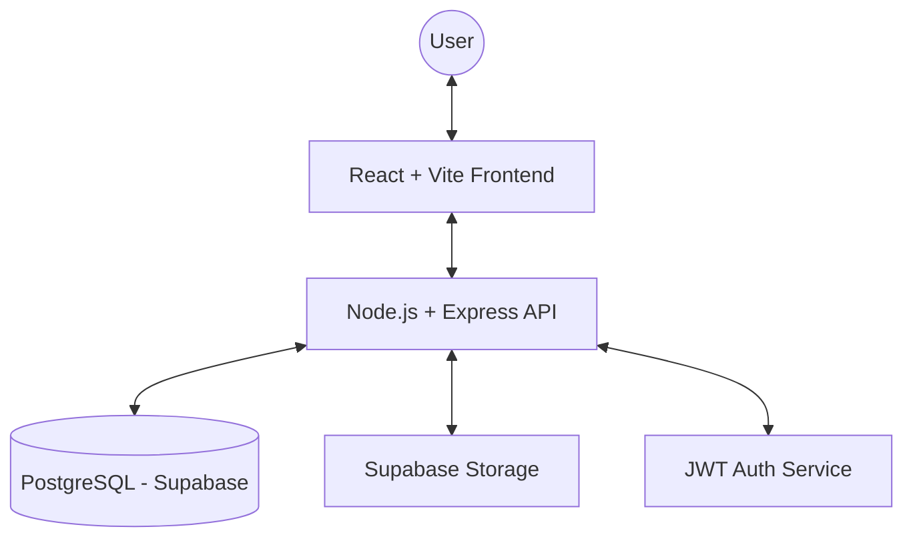

# 🚀 Sync Layer — Modern Cloud Storage System

[](https://opensource.org/licenses/MIT)
[](https://nodejs.org/)
[](https://reactjs.org/)
[](https://supabase.com/)

**Sync Layer** is a powerful, full-stack cloud storage application inspired by Google Drive. Built with the MERN stack and powered by Supabase for lightning-fast file storage and a robust PostgreSQL database.

---

## ✨ Features

### 📁 Core Management
*   **Folder System:** Create, nested navigation, move, and organized deletion.
*   **File Operations:** High-speed uploads, secure downloads via signed URLs.
*   **Trash & Recovery:** Safety net for deleted items with permanent delete or restore options.
*   **Starred Items:** Quick access to your most important files and folders.

### 🔐 Security & Access
*   **JWT Authentication:** Secure user sessions and protected API routes.
*   **File Sharing:** Share files with specific users or generate public shareable links.
*   **Version Control:** Track file history and revert to previous versions seamlessly.

### 🔍 User Experience
*   **Instant Search:** Real-time filtering and global search across all your data.
*   **Activity Logs:** Keep track of every action—uploads, deletes, and shares.
*   **File Previews:** Built-in support for viewing Images, PDFs, and more directly in the browser.
*   **Storage Metrics:** Visual tracking of your used vs. available storage capacity.

---

## 🛠 Tech Stack

| Layer | Technologies |
| :--- | :--- |
| **Frontend** | React, Vite, Tailwind CSS, Context API, Axios |
| **Backend** | Node.js, Express.js |
| **Database** | PostgreSQL (Supabase) |
| **Storage** | Supabase Storage (S3-compatible) |
| **Auth** | JWT (JSON Web Tokens), Bcrypt |

---

## 🏗 Architecture



---

## 📁 Project Structure

```text
sync-layer/
├── client/                 # React frontend application
│   ├── src/
│   │   ├── components/     # Reusable UI components
│   │   │   ├── activity/   # Activity-related components
│   │   │   ├── file/       # File operation components
│   │   │   ├── folder/     # Folder management components
│   │   │   ├── layout/     # Core layout (Header, Sidebar)
│   │   │   ├── preview/    # File preview components
│   │   │   ├── search/     # Search & Filtering
│   │   │   └── upload/     # Upload modals & logic
│   │   ├── context/        # App state management
│   │   ├── hooks/          # Custom React hooks
│   │   ├── pages/          # Page-level components (Dashboard, Auth, etc.)
│   │   └── services/       # Client-side API services
├── server/                 # Express backend API
│   ├── src/
│   │   ├── config/         # App configuration & Supabase client
│   │   ├── controllers/    # API request handlers
│   │   ├── middleware/     # Auth & error handling
│   │   ├── repositories/   # Database abstraction layer (PostgreSQL)
│   │   ├── routes/         # Express routing definitions
│   │   ├── services/       # Business logic & 3rd party integrations
│   │   └── app.js          # Main Express application setup
```

---

## ⚙️ Setup Instructions

### 1. Prerequisites
- Node.js (v18+)
- npm or yarn
- Supabase Account

### 2. Clone the Repository
```bash
git clone https://github.com/yourusername/sync-layer.git
cd sync-layer
```

### 3. Backend Configuration
1. Navigate to the server directory: `cd server`
2. Install dependencies: `npm install`
3. Create a `.env` file from the variables below:

```env
PORT=3000
SUPABASE_URL=your_supabase_url
SUPABASE_ANON_KEY=your_anon_key
SUPABASE_SERVICE_ROLE_KEY=your_service_role_key
JWT_SECRET=your_jwt_secret
```

4. Start the server: `npm run dev`

### 4. Frontend Configuration
1. Navigate to the client directory: `cd ../client`
2. Install dependencies: `npm install`
3. Start the application: `npm run dev`

---

## 📸 Screenshots

| Dashboard | File Preview |
| :---: | :---: |
|  |  |

---

## 🚀 Future Roadmap

- [ ] **Large File Support:** Implement presigned uploads for files > 50MB.
- [ ] **Collaborative Editing:** Real-time document collaboration.
- [ ] **Mobile App:** React Native companion app for cross-platform access.
- [ ] **Advanced OCR:** Automatic text extraction from uploaded images/PDFs.

---

## 👨‍💻 Author

**Abujaid Raja**
- GitHub: [@abujaidraja](https://github.com/abujaidraja)
- LinkedIn: [Your Profile](https://linkedin.com/in/yourprofile)

---

## ⚖️ License

This project is licensed under the MIT License - see the [LICENSE](LICENSE) file for details.
